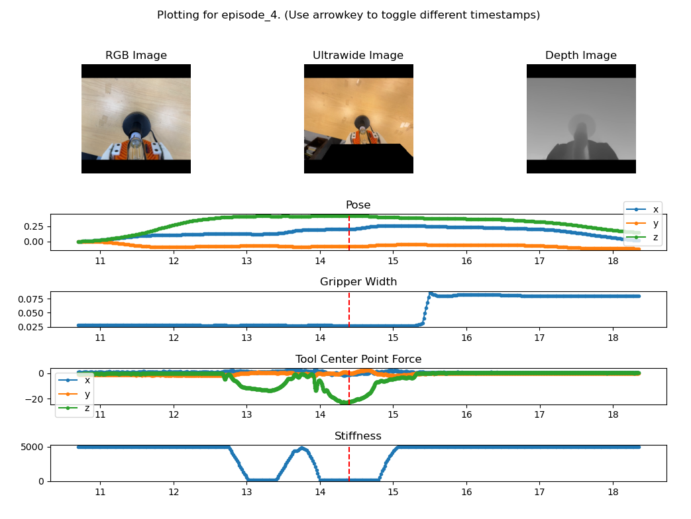

# UMI-FT
Official code base for UMI-FT.


# Data collection
UMI-FT lets you collect forceful manipulation data *without* a robot.
Please refer to [UMI-FT Hardware Instructions]([https://docs.google.com/document/d/e/2PACX-1vRrfSfjj3ct5u4bdyJYX92zH3QwZahU1D0nfb9wjb6GqDXqEZYVsaxwcCh1gwJgjRlq1fbgLJECGoPf/pub]) for building UMI-FT.

Please refer to [UMI-FT iPhone App (coming soon)](https://github.com/real-stanford/UMI-FT) for installing the data collection app on the iPhone.


1. Install [mamba](https://mamba.readthedocs.io/en/latest/installation/mamba-installation.html) and the UMIFT_Data package.
   ```bash
    pip install -e .
   ```

2. **Rename the session name on the iPhone app**  
   Set a name for the session:  
   `zucchini-skewering`  

3. **Record Gripper Calibration Video**
    - select [gripper] on the iphone to start record the gripper calibration video (open and close the gripper for > 10 times) 

4. **Record Demos**
    - Set script constants for coinft data collection
        Set user-specific variables such as `$raw_umi_data_dir`, `$session_name`, `$PORT` and `$time`in the script, `bash/wired_collect_data.sh`
        - `$time`: the duration in seconds for the data collection, make sure to be longer than demo. The data collection should start earlier than the demo (iPhone), and end later than the demo (iPhone).
        - `$session_name`: Should match the session name set on the UMI_day app.
        - `$PORT`: This is the serial port to the microcontroller connecting the two CoinFTs.
        - `$raw_umi_data_dir`: Specifies the data path relative to `<UMIFT_REPO_ROOT>` where the multimodal data is stored.

   - Start the FT recording script in `{repo}/UMIFT_Data` (The FT data collection was tested on macOS):
     ```bash
     conda activate umift_datacollection
     bash bash/wired_collect_data.sh
     ```
     - The FT data will be saved to:  
        `<UMIFT_REPO_ROOT>/UMIFT_Data/data/umift_data/<session_name>/coinft`

   - Record demos using the "Start Recording" button on the UMI_day iPhone app. 🎥
   - Stop the iPhone recording after the demo is complete.
   - Wait for CoinFT data collection to finish.

5. **Export Demos from SD Card**  
   Save the data to the following folder: 
     `<SD_CARD_DIR>/UMI_iPhone/export_<SESSION_TIME>` → `<UMIFT_REPO_ROOT>/UMIFT_Data/data/umift_data/<session_name>/UMI_iPhone`

### Recommended Folder Structure
```
<raw_umi_data_dir>/ (:=<UMIFT_REPO_ROOT>/data/umift_data)
├── <session_name>/
│   ├── UMI_iphone/
│   │   ├── export_<YYYY-MM-DD_TIME>/
│   │   │   ├── <TIME>_<side>.json
│   │   │   ├── ...
│   ├── coinft/
│   │   ├── YYYY-MM-DD/
│   │   │   ├── <COINFT_FILE>_LF.csv
│   │   │   ├── <COINFT_FILE>_RF.csv
│   │   │   ├── ...
```

---

# Data Processing


## 🔬 Data Postprocessing Instructions 

Follow the instructions below in `{repo_root}/UMIFT_Data`.

### 1. Set Constants in Postprocessing Scripts
Set user-specific variables such as `$raw_umi_data_dir` and `$session_name` in the following scripts for your collected data session:
    - `bash/data_post_process_gopro_iphone.sh`
    - `bash/data_post_process_multimodal.sh`

- `$session_name`: Should match the session name set on the iPhone app.
- `$raw_umi_data_dir`: Specifies the data path relative to `<UMIFT_REPO_ROOT>` where the multimodal data is stored.

### 2. Folder Assumptions 📁
```
<raw_umi_data_dir>/ (:=<UMIFT_REPO_ROOT>/UMIFT_Data/data/umift_data)
├── <session_name>/
│   ├── UMI_iphone/
│   │   ├── export_<YYYY-MM-DD_TIME>/
│   │   │   ├── <TIME>_<side>.json
│   │   │   ├── ...
│   ├── coinft/
│   │   ├── YYYY-MM-DD/
│   │   │   ├── <COINFT_FILE>_LF.csv
│   │   │   ├── <COINFT_FILE>_RF.csv
│   │   │   ├── ...
│   ├── processed_data/ (output from data processing)
│   │   ├── gopro_iphone/
│   │   ├── all/
```

---

### 3. Run Postprocessing Commands
The following was tested in Linux 22.04.
Note: The following requires [umi_day package (coming soon with the iPhone app)](https://github.com/real-stanford/UMI-FT)

#### Postprocess the iPhone Data
```bash
conda activate umi_day
bash bash/data_post_process_iphone.sh
```

#### Postprocess All Other Data + Time Sync + Visualization
```bash
conda activate umift
bash bash/data_post_process_multimodal.sh
```


### 4. Merge Data
Using `scripts/zarr_utils.py`, merge any relevant demonstration sessions into one by properly setting `input_zarrs` and `output_zarr`. This step is recommended even whwen there is only one session.

### 5. Postprocessing for Adaptive Compliance Policy
Move to `{repo_root}`.

#### Setup for Adaptive Compliance Policy
The following is tested with Python 3.12 on Ubuntu 22.04 and 24.04.

1. Create a virtual env called `pyrite`:
``` sh
mamba create -n pyrite python=3.12
mamba activate pyrite
# We recommend to install bulky packages first
# Install a version of pytorch that works with your cuda version: https://pytorch.org/get-started/locally/ 
pip3 install torch torchvision torchaudio
pip3 install timm diffusers accelerate
# Pickup remaining packages in the env yaml
mamba env update --name pyrite --file PyriteML/conda_environment.yaml
# A few pip installs
pip install v4l2py
pip install toppra
pip install atomics
pip install vit-pytorch # Need at least 1.7.12, which was not available in conda
pip install imagecodecs # Need at least 2023.9.18, which caused lots of conflicts in conda
```

2. Setup environment variables: add the following to your .bashrc or .zshrc, edit according to your local path.
``` sh
# where the processed zarr dataset files are
export PYRITE_DATASET_FOLDERS=$HOME/data/real_processed
# Each training session will create a folder here.
export PYRITE_CHECKPOINT_FOLDERS=$HOME/training_outputs

# Change this to the actual path where you cloned UMI-FT
export UMIFT_ROOT=$HOME/path/to/UMI-FT

# For smooth execution
export PYTHONPATH=$UMIFT_ROOT/PyriteML:$UMIFT_ROOT/PyriteML/multimodal_representation/multimodal:$UMIFT_ROOT:$PYTHONPATH
```
#### Adding Compliance Labels

The postprocessing script is `{repo_root}/PyriteUtility/PyriteUtility/data_pipeline/postprocessing_add_virtual_target_label_umift.py`.

##### Generate labels
To do postprocessing (generates virtual targets/stiffness labels): edit the following in the script before running it:
``` py
# Config for umift (single robot)
dataset_path = "{one_level_above_the_path_to_your_merged_data}/acp_replay_buffer_gripper.zarr/"
id_list = [0] # for bimanual, it should be [0, 1]

num_of_process = 5 # parallelization uses a lot of memory, don't make this number too big. Stable when set to 1.
flag_plot = False
```
The other parameters can stay the same.
After this is done, the dataset should be ready for training.

> Note: The script also offset the timestamps in the data by finding the smallest time among all timestamps, then subtract it from all timestamps.

##### Visualize data
To plot the reference trajectory and generated virtual target trajectory, set the following:

``` sh
num_of_process = 1
flag_plot = True
fin_every_n = 5  # plot a line from ref to vt point every xx points. 5 is good for umift.
```


### 6. Output Zarr Data Format 📦

Example zarr data tree for 200 demos:
```
data.tree()
/
 ├── data
 .....
 │   ├── episode_95                                                                                                          
 │   │   ├── depth_0 (158, 224, 224, 3) float16                                                                              
 │   │   ├── depth_time_stamps_0 (158, 1) float64                                                                            
 │   │   ├── gripper_0 (315, 1) float64                                                                                      
 │   │   ├── gripper_time_stamps_0 (315, 1) float64                                                                          
 │   │   ├── map_to_d_idx_0 (315, 1) int64                                                                                   
 │   │   ├── map_to_uw_idx_0 (315, 1) int64                                                                                  
 │   │   ├── rgb_0 (315, 224, 224, 3) uint8                                                                                  
 │   │   ├── rgb_time_stamps_0 (315, 1) float64                                                                              
 │   │   ├── robot_time_stamps_0 (315, 1) float64                                                                            
 │   │   ├── stiffness_0 (315,) float64                                                                                      
 │   │   ├── ts_pose_command_0 (315, 7) float64                                                                              
 │   │   ├── ts_pose_fb_0 (315, 7) float64                                                                                   
 │   │   ├── ts_pose_virtual_target_0 (315, 7) float64                                                                       
 │   │   ├── ultrawide_0 (53, 224, 224, 3) uint8                                                                             
 │   │   ├── ultrawide_time_stamps_0 (53, 1) float64                                                                         
 │   │   ├── wrench_concat_0 (7922, 12) float64                                                                              
 │   │   ├── wrench_concat_coinft_0 (7922, 12) float64                                                                       
 │   │   ├── wrench_left_0 (7922, 6) float64                                                                                 
 │   │   ├── wrench_left_coinft_0 (7922, 6) float64                                                                          
 │   │   ├── wrench_right_0 (7922, 6) float64                                                                                
 │   │   ├── wrench_right_coinft_0 (7922, 6) float64                                                                         
 │   │   ├── wrench_time_stamps_0 (7922, 1) float64                                                                          
 │   │   ├── wrench_time_stamps_left_0 (7922, 1) float64                                                                     
 │   │   └── wrench_time_stamps_right_0 (7922, 1) float64
 │   ├── episode_96                                                                                                          
 │   │   ├── depth_0 (163, 224, 224, 3) float16                                                                              
 │   │   ├── depth_time_stamps_0 (163, 1) float64                                                                            
 │   │   ├── gripper_0 (326, 1) float64                                                                                      
 │   │   ├── gripper_time_stamps_0 (326, 1) float64                                                                          
 │   │   ├── map_to_d_idx_0 (326, 1) int64                                                                                   
 │   │   ├── map_to_uw_idx_0 (326, 1) int64                                                                                  
 │   │   ├── rgb_0 (326, 224, 224, 3) uint8                                                                                  
 │   │   ├── rgb_time_stamps_0 (326, 1) float64                                                                              
 │   │   ├── robot_time_stamps_0 (326, 1) float64                                                                            
 │   │   ├── stiffness_0 (326,) float64                                                                                      
 │   │   ├── ts_pose_command_0 (326, 7) float64                                                                              
 │   │   ├── ts_pose_fb_0 (326, 7) float64                                                                                   
 │   │   ├── ts_pose_virtual_target_0 (326, 7) float64                                                                       
 │   │   ├── ultrawide_0 (55, 224, 224, 3) uint8                                                                             
 │   │   ├── ultrawide_time_stamps_0 (55, 1) float64                                                                         
 │   │   ├── wrench_concat_0 (7924, 12) float64                                                                              
 │   │   ├── wrench_concat_coinft_0 (7924, 12) float64                                                                       
 │   │   ├── wrench_left_0 (7924, 6) float64                                                                                 
 │   │   ├── wrench_left_coinft_0 (7924, 6) float64                                                                          
 │   │   ├── wrench_right_0 (7924, 6) float64                                                                                
 │   │   ├── wrench_right_coinft_0 (7924, 6) float64                                                                         
 │   │   ├── wrench_time_stamps_0 (7924, 1) float64                                                                          
 │   │   ├── wrench_time_stamps_left_0 (7924, 1) float64                                                                     
 │   │   └── wrench_time_stamps_right_0 (7924, 1) float64
 .....
 └── meta
     ├── episode_depth0_len (200,) int64
     ├── episode_gripper0_len (200,) int64
     ├── episode_rgb0_len (200,) int64
     ├── episode_robot0_len (200,) int64
     ├── episode_ultrawide0_len (200,) int64
     └── episode_wrench0_len (200,) int64

```

Wrench data order assumption: [Fx, Fy, Fz, Mx, My, Mz]

Wrench body frame and world frame transformation in accordance with convention from [Modern Robotics, Lynch & Park](https://hades.mech.northwestern.edu/images/7/7f/MR.pdf#page=126.68) 

### 7. Data Visualization
Run `{repo_root}/UMIFT_Data/scripts/plot_dataset_umift_ultrawide_depth.py` with the proper dataset path.


# Policy Training

## Training the manipulation policy
Our policy is an extended version of Adaptive Compliance Policy, which is built on top of Diffusion Policy.

Properly set path to dataset and task specific parameters in `PyriteML/diffusion_policy/config/train_umift_workspace.yaml`. Other than the dataset path, most of the parameters can stay the same.

Before launching training, setup accelerator if you haven't done so:
``` sh
accelerate config
```

Then launch training with:
``` sh
HYDRA_FULL_ERROR=1 accelerate launch train.py --config-name=train_umift_workspace
```
Or, train with multiple GPU like this
``` sh
HYDRA_FULL_ERROR=1 accelerate launch --gpu_ids 0,1,2,3 --num_processes=4 train.py --config-name=train_umift_workspace
```


# Real World Deployment
Note that all the hardware IPs in the system need to be within the same subnet, such as 192.168.0.xxx. This includes your desktop, UR robot, WSG gripper, and iPhone.

## Install control software
First we need to install hardware control softwares. They are written in c++ and require cmake and gcc/g++. 

Before building the packages, make sure the conda packages we installed before are visible to c++ linkers. You can do so by creating a .sh file with the following content:
``` sh
export LD_LIBRARY_PATH=$HOME/miniforge3/envs/pyrite/lib/:$LD_LIBRARY_PATH
```
at `${CONDA_PREFIX}/etc/conda/activate.d/`, e.g. `$HOME/miniforge3/envs/pyrite/etc/conda/activate.d` if you install miniforge at the default location.


Then pull the following packages:
``` sh
# https://github.com/yifan-hou/cpplibrary
git clone git@github.com:yifan-hou/cpplibrary.git
# https://github.com/yifan-hou/force_control
git clone git@github.com:yifan-hou/force_control.git
# https://github.com/yifan-hou/hardware_interfaces
git clone git@github.com:yifan-hou/hardware_interfaces.git
```
Then build & install following their readme, following this order.

### (Optional) Install to a local path
We recommend to install to a local path for easy maintainence, also you don't need sudo access. To do so, replace the line
``` sh
cmake ..
```
with
``` sh
cmake -DCMAKE_INSTALL_PREFIX=$HOME/.local  ..
```
when building packages above. Here `$HOME/.local` can be replaced with any local path.
Then you need to tell gcc to look for binaries/headers from your local path by adding the following to your .bashrc or .zshrc:
``` sh
export PATH=$HOME/.local/bin:$PATH
export C_INCLUDE_PATH=$HOME/.local/include/:$C_INCLUDE_PATH
export CPLUS_INCLUDE_PATH=$HOME/.local/include/:$CPLUS_INCLUDE_PATH
export LD_LIBRARY_PATH=$HOME/.local/lib/:$LD_LIBRARY_PATH
```
You need to run `source .bashrc` or reopen a terminal for those to take effect.

## Setup UR robot
We support both e series and the old non-e series Universal Robots. We use the CoinFT sensors directly for the low-level compliance control, so the internal FT sensor of UR e series is not required.

For UR robot, please update the following fields in [the config](https://github.com/yifan-hou/hardware_interfaces/blob/main/workcell/table_top_manip/config/right_arm_coinft.yaml#L37-L54): robot_ip, safe_zone.

If you use a different robot, please update hardware_interfaces accordingly.


## Setup CoinFT
Indicate the location of calibration files in the hardware config. [Here is an example](https://github.com/yifan-hou/hardware_interfaces/blob/main/workcell/table_top_manip/config/right_arm_coinft.yaml#L77-L80).

### Install C++ Dependencies

**1. ONNX Runtime**
The CoinFT driver expects the ONNX Runtime C++ library to be located at `/opt/onnxruntime`.
Run the following commands to download and set it up:

```bash
# 1. Download ONNX Runtime (v1.16.3 is recommended)
wget [https://github.com/microsoft/onnxruntime/releases/download/v1.16.3/onnxruntime-linux-x64-1.16.3.tgz](https://github.com/microsoft/onnxruntime/releases/download/v1.16.3/onnxruntime-linux-x64-1.16.3.tgz)

# 2. Extract the file
tar -xvzf onnxruntime-linux-x64-1.16.3.tgz

# 3. Move it to the required location (Requires sudo)
sudo mv onnxruntime-linux-x64-1.16.3 /opt/onnxruntime
```


## Setup WSG gripper
After the WSG gripper is powered on and connected (you may need to manually set your local network config to the same subnet, if you cannot ping the gripper), access the web interface by typing the gripper ip in a browser.

In Scripting/Interactive Scripting, paste [the driver code here](https://github.com/yifan-hou/hardware_interfaces/blob/main/hardware/wsg_gripper/src/cmd_customized_controllers.lua) and run it.

Then update the wsg gripper IP in the [corresponding hardware config field](https://github.com/yifan-hou/hardware_interfaces/blob/main/workcell/table_top_manip/config/right_arm_coinft.yaml#L113-L128).

## Setup iPhone for streaming
Set IP address and port in the iPhone app `umi_day_iphone/ViewController` (App coming soon):
```py
   var hostIP: String = "192.168.2.18"
   var hostPort: Int = 5555
```

Update the iPhone ip at the top of umift_env_runner.py: 
``` py
pipeline_para = {
        "iphone_params": {
            "socket_ip": "192.168.2.18",
            "ports": [5555],
        },
        ...
}
```

## Before you launch the test
Tell the driver where is your hardware config and log folder:
``` sh
# Hardware configs.
export PYRITE_HARDWARE_CONFIG_FOLDERS=$HOME/git/RobotTestBench/applications/ur_test_bench/config
# Logging folder.
export PYRITE_CONTROL_LOG_FOLDERS=$HOME/data/control_log
```
After building the `hardware_interfaces` package, a pybind library is generated under `hardware_interfaces/workcell/table_top_manip/python/`. This library contains a c++ multi-thread server that maintains low-latency communication and data/command buffers with all involved hardware except for iPhone. It also maintains an admittance controller. We will launch a python script that communicates with the hardware server, while the python script itself does not need multi-processing.

Before testing, check the following:
1. `pyrite` virtual environment is activated.
2. Env variables `PYRITE_CHECKPOINT_FOLDERS`, `PYRITE_HARDWARE_CONFIG_FOLDERS`, `PYRITE_CONTROL_LOG_FOLDERS` are properly set.
3. You have specified name of the checkpoint folder and the hardware config file in `UMI-FT/PyriteEnvSuites/env_runners/umift_env_runner.py`.


## Launching experiment
* UR robot: From the teach pendant, jog the robot to a suitable initial pose, then switch to remote mode. 
* WSG gripper: from the web interface, make sure the lua script is running. 
* iPhone: Open the umi-day app on iPhone. You can turn off visualization to slow down the heating. Make sure both rgb and depth are streaming.
* Run `python UMI-FT/PyriteEnvSuites/scripts/kill_ports.py` to kill any process that is listening on the ports we use. They are likely created by previous failed runs.
* Then start execution by running `UMI-FT/PyriteEnvSuites/env_runners/umift_env_runner.py`.

The script will first launch the manpulation server, which initialize all the hardware specified in the hardware config file. A video streaming window will pop up. When the video stream looks good (actual video is streaming, no black screen), press `q` to leave the window and continue the test by following onscreen instructions.

## Citation
If you find this codebase useful, feel free to cite our paper:
```bibtex
@misc{choi2026inthewildcompliantmanipulationumift,
      title={In-the-Wild Compliant Manipulation with UMI-FT}, 
      author={Hojung Choi and Yifan Hou and Chuer Pan and Seongheon Hong and Austin Patel and Xiaomeng Xu and Mark R. Cutkosky and Shuran Song},
      year={2026},
      eprint={2601.09988},
      archivePrefix={arXiv},
      primaryClass={cs.RO},
      url={https://arxiv.org/abs/2601.09988},
      }
```

## License
This repository is released under the MIT license. 

## Acknowledgement
This work was supported in part by the NSF Award #2143601, #2037101, and #2132519, Toyota Research Institute, Samsung and Amazon. We thank Google and TRI for the UR5 robot hardware. We thank Huy Ha, Zeyi Liu, and other members of the Robotics and Embodied Artificial Intelligence Lab for the fruitful discussions. We also thank Alice Wu, Eric Cousineau, Rick Cory, Jeannette Bohg for
their valuable advice and insights. The views and conclusions contained herein are those of the authors and should not be interpreted as necessarily representing the official policies, either expressed or implied, of the sponsors.

## Code References
* [Adaptive Compliance Policy](https://github.com/yifan-hou/adaptive_compliance_policy)
* [universal_manipulation_interface](https://github.com/real-stanford/universal_manipulation_interface).
* [multimodal_representation](https://github.com/stanford-iprl-lab/multimodal_representation)


